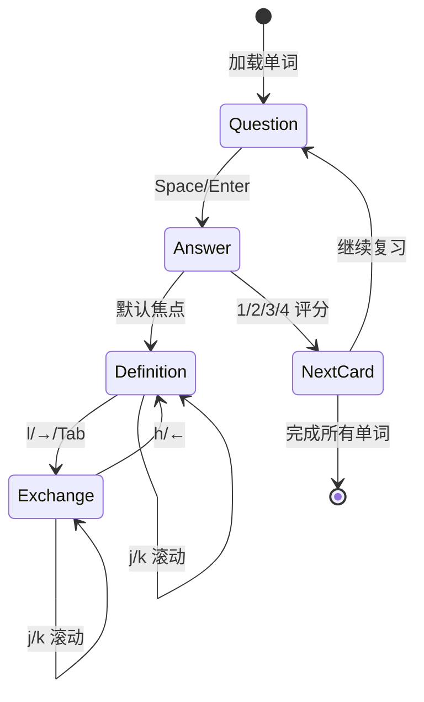

# 交互设计文档 (Interaction Design)

**版本**: v2.3  
**日期**: 2025-11-30  
**作者**: GitHub Copilot

## 概述

本文档详细说明 lexRain 词汇学习应用中各个组件之间的交互设计，包括面板切换、滚动操作和键位绑定。

## 1. Review 组件交互设计

### 1.1 面板布局

Review 界面在显示答案时采用双面板布局：

```
┌─────────────────────────────────────────────┐
│           Progress Bar (3 lines)            │
├─────────────────────────────────────────────┤
│        Word Header (5 lines)                │
│  Word + Phonetic                            │
│  POS + Collins + Oxford                     │
│  Exam Tags                                  │
├──────────────────────┬──────────────────────┤
│  释义面板 (70%)       │  词形变化面板 (30%)   │
│  - 中文释义           │  - 过去式             │
│  - English Definition│  - 过去分词           │
│  - 词频信息           │  - 现在分词           │
│                      │  - 第三人称单数       │
│                      │  - 复数               │
│                      │  - 比较级             │
│                      │  - 最高级             │
└──────────────────────┴──────────────────────┘
```

### 1.2 键位绑定

#### 问题状态 (Question State)
| 按键 | 功能 |
|------|------|
| `Space` / `Enter` | 显示答案 |
| `q` / `Esc` | 返回主菜单 |

#### 答案状态 (Answer State)

**面板切换**:
| 按键 | 功能 |
|------|------|
| `h` / `←` (Left Arrow) | 切换到释义面板 (左侧) |
| `l` / `→` (Right Arrow) / `Tab` | 切换到词形变化面板 (右侧) |

**滚动操作** (作用于当前激活面板):
| 按键 | 功能 |
|------|------|
| `j` / `↓` (Down Arrow) | 向下滚动 |
| `k` / `↑` (Up Arrow) | 向上滚动 |

**评分操作**:
| 按键 | 功能 | SM2 质量评分 |
|------|------|-------------|
| `1` | 完全不记得 | Quality 1 |
| `2` | 错误但记得 | Quality 2 |
| `3` | 困难但正确 | Quality 3 |
| `4` | 完美回忆 | Quality 4 |

**退出**:
| 按键 | 功能 |
|------|------|
| `q` / `Esc` | 返回主菜单 |

### 1.3 视觉反馈

#### 激活状态指示
- **释义面板激活时**:
  - 边框颜色: Cyan (青色)
  - 标题: ` 释义 (j/k: scroll, l/→: 切换) [FOCUSED] `
  
- **释义面板未激活时**:
  - 边框颜色: 默认
  - 标题: ` 释义 (h/←: 切换) `

- **词形变化面板激活时**:
  - 边框颜色: Magenta (品红)
  - 标题: ` 词形变化 (j/k: scroll, h/←: 切换) [FOCUSED] `
  
- **词形变化面板未激活时**:
  - 边框颜色: 默认
  - 标题: ` 词形变化 (l/→/Tab: 切换) `

#### 滚动条显示
- 当内容高度超过可视区域时，自动显示滚动条
- 滚动条位置反映当前滚动位置
- 左侧面板滚动条在右边缘
- 右侧面板滚动条在右边缘

### 1.4 交互流程



## 2. Dictionary 组件交互设计

### 2.1 面板布局

Dictionary 界面采用三层垂直布局：

```
┌─────────────────────────────────────────────┐
│     Search Input (3 lines)                  │
├─────────────────────────────────────────────┤
│     Word List Table (Min 10 lines)          │
│  Status │ Word │ Phonetic │ Interval        │
│    ◯    │ word │  [wɜːd]  │ 5 days          │
│    ◐    │ test │  [test]  │ 3 days          │
│    ●    │ ...  │  ...     │ ...             │
├─────────────────────────────────────────────┤
│     Word Detail (20 lines, scrollable)      │
│  Word + Phonetic                            │
│  POS + Collins + Oxford                     │
│  Exam Tags                                  │
│  ━━━ 中文释义 ━━━                           │
│  ...                                        │
│  ━━━ English Definition ━━━                 │
│  ...                                        │
│  ━━━ 词形变化 ━━━                           │
│  ...                                        │
│  词频: BNC / 当代                            │
│  ━━━ 学习状态 ━━━                           │
│  ...                                        │
└─────────────────────────────────────────────┘
```

### 2.2 键位绑定

**导航操作**:
| 按键 | 功能 |
|------|------|
| `j` / `↓` (Down Arrow) | 下一个单词 |
| `k` / `↑` (Up Arrow) | 上一个单词 |
| `PageDown` | 向下翻 10 个单词 |
| `PageUp` | 向上翻 10 个单词 |
| `g` / `Home` | 跳到第一个单词 |
| `G` / `End` | 跳到最后一个单词 |

**详情滚动**:
| 按键 | 功能 |
|------|------|
| `h` / `←` (Left Arrow) | 详情面板向上滚动 |
| `l` / `→` (Right Arrow) | 详情面板向下滚动 |

**搜索功能**:
| 按键 | 功能 |
|------|------|
| `字母/数字` | 输入搜索内容 |
| `Backspace` | 删除搜索字符 |

**退出**:
| 按键 | 功能 |
|------|------|
| `q` / `Esc` | 返回主菜单 |

### 2.3 视觉反馈

#### 学习状态指示
| 符号 | 颜色 | 状态 |
|------|------|------|
| ◯ | Gray | New (新词) |
| ◐ | Yellow | Learning (学习中) |
| ● | Green | Mastered (已掌握) |

#### 详情面板
- 边框颜色: Cyan (青色)
- 标题: ` Detail (h/l: scroll) `
- 滚动条: 内容超长时自动显示

#### 列表高亮
- 当前选中行: Green + Bold
- 位置指示器: 右下角显示 `| x/total |`

### 2.4 搜索行为
- 实时搜索：每次输入立即更新结果
- 搜索范围：单词拼写 (spelling)
- 空搜索：显示所有单词（前 10000 条）
- 自动重置：搜索结果变化时自动跳到第一个结果，详情滚动重置为顶部

## 3. History 组件交互设计

### 3.1 键位绑定

**导航操作**:
| 按键 | 功能 |
|------|------|
| `j` / `↓` (Down Arrow) | 下一条记录 |
| `k` / `↑` (Up Arrow) | 上一条记录 |
| `PageDown` | 向下翻 10 条 |
| `PageUp` | 向上翻 10 条 |
| `g` / `Home` | 跳到第一条 |
| `G` / `End` | 跳到最后一条 |

**退出**:
| 按键 | 功能 |
|------|------|
| `q` / `Esc` | 返回主菜单 |

### 3.2 视觉反馈

#### 当前项高亮
- 标记: `>> ` 前缀
- 背景: Black
- 前景: Cyan

## 4. 设计原则

### 4.1 一致性原则
- **j/k**: 所有组件中统一用于向下/向上操作
  - Review: 滚动当前激活面板
  - Dictionary: 切换单词列表
  - History: 切换历史记录

- **h/l**: 
  - Review: 切换左右面板焦点
  - Dictionary: 滚动详情面板（因为 j/k 已用于列表导航）

- **g/G**: 统一用于跳转到第一个/最后一个
  - Dictionary: 第一个/最后一个单词
  - History: 第一条/最后一条记录

- **q/Esc**: 统一用于退出当前界面

### 4.2 可发现性原则
- 所有面板标题中包含操作提示
- 激活状态通过 `[FOCUSED]` 标记明确指示
- 边框颜色变化提供视觉反馈
- 滚动条自动显示内容是否超长

### 4.3 防错原则
- 切换选项时自动重置滚动位置
- 不同面板使用不同颜色边框避免混淆
- 评分操作 (1-4) 与导航操作分离，避免误触

### 4.4 效率原则
- 支持 Vim 风格快捷键 (hjkl)
- 支持方向键作为备选
- PageUp/Down 支持快速翻页
- Tab 键快速切换面板

## 5. 技术实现细节

### 5.1 状态管理

#### ReviewComponent
```rust
pub struct ReviewComponent {
    scroll: u16,              // 释义面板滚动位置
    exchange_scroll: u16,      // 词形变化面板滚动位置
    active_panel: ActivePanel, // 当前激活的面板
    // ... 其他字段
}

pub enum ActivePanel {
    Definition,  // 释义面板
    Exchange,    // 词形变化面板
}
```

#### DictionaryComponent
```rust
pub struct DictionaryComponent {
    selected_index: usize,    // 当前选中的单词索引
    detail_scroll: u16,       // 详情面板滚动位置
    // ... 其他字段
}
```

### 5.2 滚动逻辑

所有滚动操作使用 `saturating_add` 和 `saturating_sub` 防止溢出：

```rust
// 向下滚动
self.scroll = self.scroll.saturating_add(1);

// 向上滚动
self.scroll = self.scroll.saturating_sub(1);
```

### 5.3 自动重置

切换到新内容时自动重置滚动：

```rust
fn next_card(&mut self) {
    // ...
    self.scroll = 0;
    self.exchange_scroll = 0;
    self.active_panel = ActivePanel::Definition;
}

fn select_next(&mut self) {
    // ...
    self.detail_scroll = 0;
}
```

## 6. 用户场景

### 6.1 Review 场景
1. 用户看到单词后按 `Space` 显示答案
2. 默认焦点在释义面板，可以用 `j/k` 滚动查看完整的中英文释义
3. 按 `l` 或 `→` 切换到词形变化面板
4. 在词形变化面板用 `j/k` 滚动查看所有词形
5. 按 `h` 或 `←` 返回释义面板
6. 评估记忆情况，按 `1-4` 评分
7. 自动进入下一个单词

### 6.2 Dictionary 场景
1. 用户输入搜索词 "perceive"
2. 列表自动过滤，用 `j/k` 浏览搜索结果
3. 选中某个单词后，详情面板自动显示完整信息
4. 如果信息过长，用 `h/l` 上下滚动查看
5. 按 `q` 返回主菜单

## 7. 已知限制

1. Review 组件的双面板只有在显示答案时可用
2. Dictionary 的详情面板使用 h/l 滚动，与 Review 的面板切换不同（因为 j/k 已用于列表导航）
3. 长定义可能需要多次滚动才能查看完整内容

## 8. 未来改进方向

1. **鼠标支持**: 支持滚轮滚动和点击切换
2. **快捷键自定义**: 允许用户自定义键位绑定
3. **面板大小调整**: 允许用户调整左右面板的比例
4. **搜索历史**: Dictionary 组件记住最近的搜索词
5. **批注功能**: 允许用户为单词添加个人笔记

---

**文档版本历史**:
- v2.3 (2025-11-30): 初始版本，详细记录所有组件的交互设计
